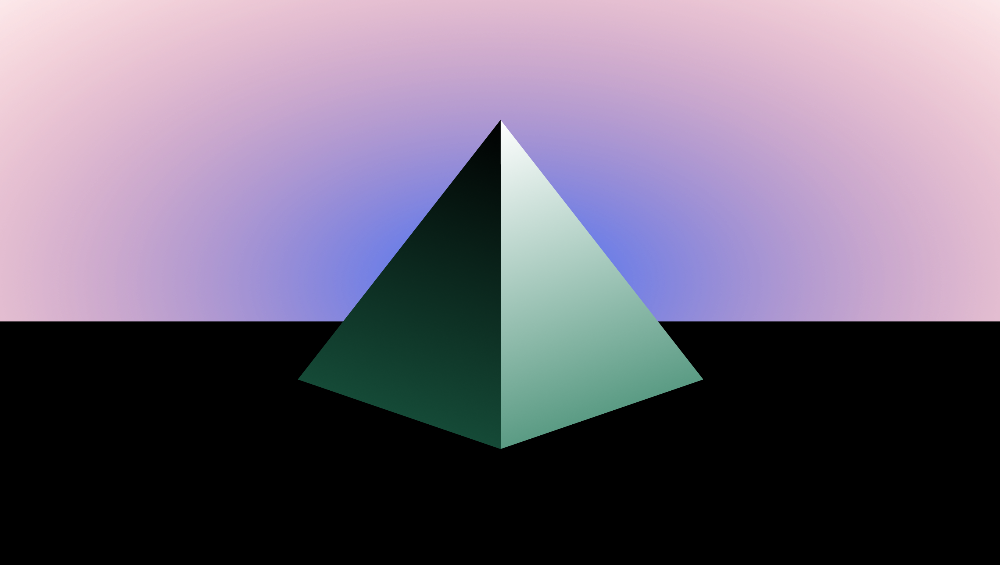

# The Pyramid

The Pyramid is:
* Ownable - It is a single ERC 721 token which can be sent to others and displayed in your wallet or OpenSea collection like any other NFT.
* Fickle - Anyone can take the Pyramid from its current owner by depositing ETH into it (at least 10% more than the last time it was taken.)
* Rewarding - 100 days after it is created, anyone who currently owns the Pyramid can unlock it to receive the ETH contained within it.
